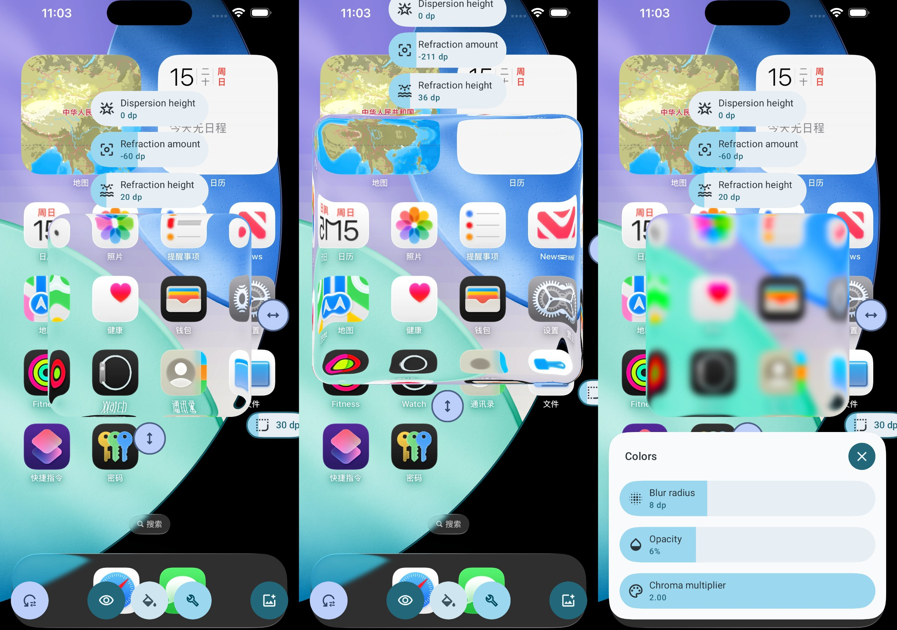
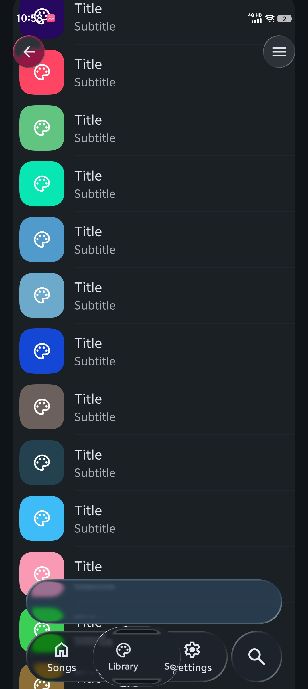

# Liquid Glass

Apple's Liquid Glass effect for Android Jetpack Compose.

Check the [demo app](./app/release/app-release.apk), Android 13 and above is required.



Here is a screenshot of a music player demo



## Library

The library is in alpha stage, every API may be changed, use it on your own risk.

### Add to project

[](https://jitpack.io/#Kyant0/AndroidLiquidGlass)

```kotlin
// settings.gradle.kts in root project
dependencyResolutionManagement {
    repositories {
        maven("https://jitpack.io")
    }
}

// build.gradle.kts in module
implementation("com.github.Kyant0:AndroidLiquidGlass:<version>")
```

### Examples

```kotlin
val providerState = rememberLiquidGlassProviderState(
    backgroundColor = Color.White
)

// content behind the glass
Box(Modifier.liquidGlassProvider(providerState))

// glass
Box(
    Modifier.liquidGlass(
        providerState,
        LiquidGlassStyle(
            shape = CornerShape.large,
            innerRefraction = InnerRefraction(
                height = RefractionValue(8.dp),
                amount = RefractionValue.Full // or any negative value like RefractionValue((-16).dp)
            ),
            material = GlassMaterial(
                blurRadius = 8.dp,
                whitePoint = 0.1f,
                chromaMultiplier = 1.5f
            )
        )
    )
)
```

### Limitations

The following case is not supported:

```kotlin
LiquidGlassProvider(providerState) {
    LiquidGlass(providerState) {}
}
```

Instead, you should rewrite it like this:

```kotlin
Box {
    LiquidGlassProvider(providerState) {}
    LiquidGlass(providerState) {}
}
```

## Glass parameters

|        Parameter        | Availability | Verification |
|:-----------------------:|--------------|--------------|
| Inner refraction height | ✔️           | ✔️           |
| Inner refraction amount | ✔️           | ✔️           |
| Outer refraction height | ❌            | ❌            |
| Outer refraction amount | ❌            | ❌            |
|      Bleed amount       | ✔️           | ❌            |
|    Bleed blur radius    | ✔️           | -            |
|      Bleed opacity      | ✔️           | ❌            |
|       Blur radius       | ✔️           | -            |

Other extensions:

- Border color, width, angle, decay
- Contrast, white point, chroma multiplier
- Eccentric factor
- Dispersion height (🚧)

## Comparisons

Android device: Google Pixel 4 XL (the smallest width is adjusted to 440 dp to match the density of the iOS device)

iOS device: iPhone 16 Pro Max (simulator)

Test glass area size: 300 x 300, corner radius: 30

|                        iOS                        |                        Android                        |
|:-------------------------------------------------:|:-----------------------------------------------------:|
|  |  |

Complete comparisons:

- [Inner refraction](docs/Inner%20refraction%20comparisons.md)
- [Bleed](docs/Bleed%20comparisons.md)

## Special thanks

- [GlassExplorer](https://github.com/ktiays/GlassExplorer)

## Star history

[](https://www.star-history.com/#Kyant0/AndroidLiquidGlass&Date)
