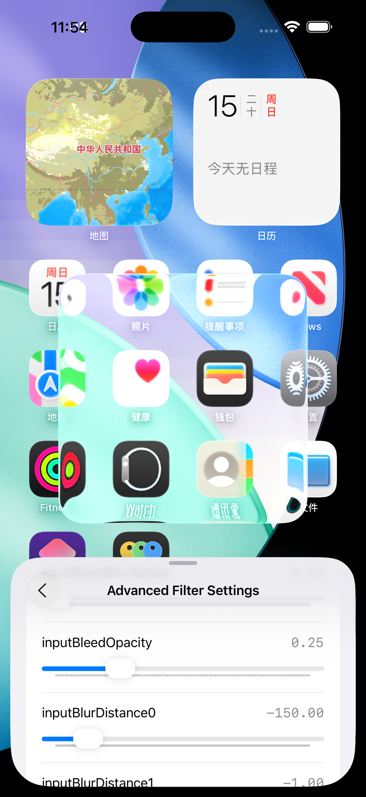
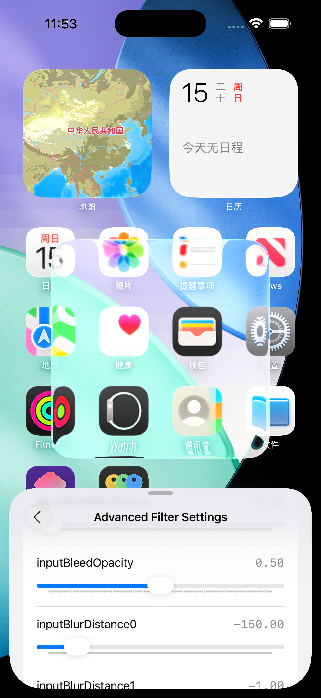
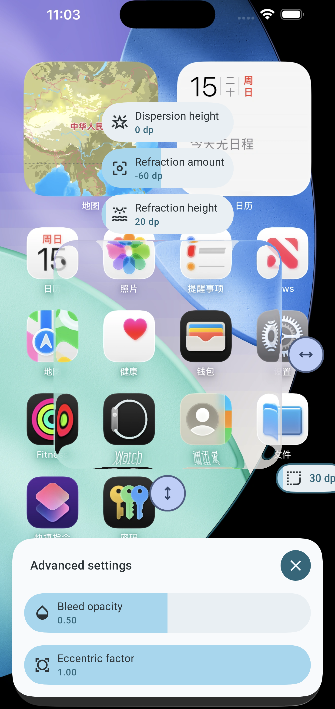
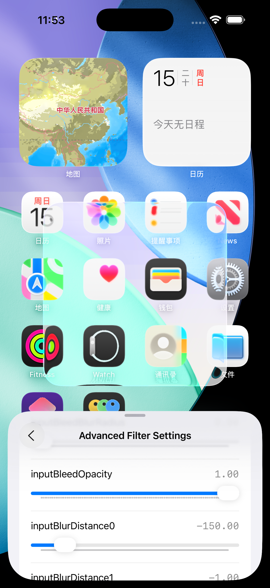
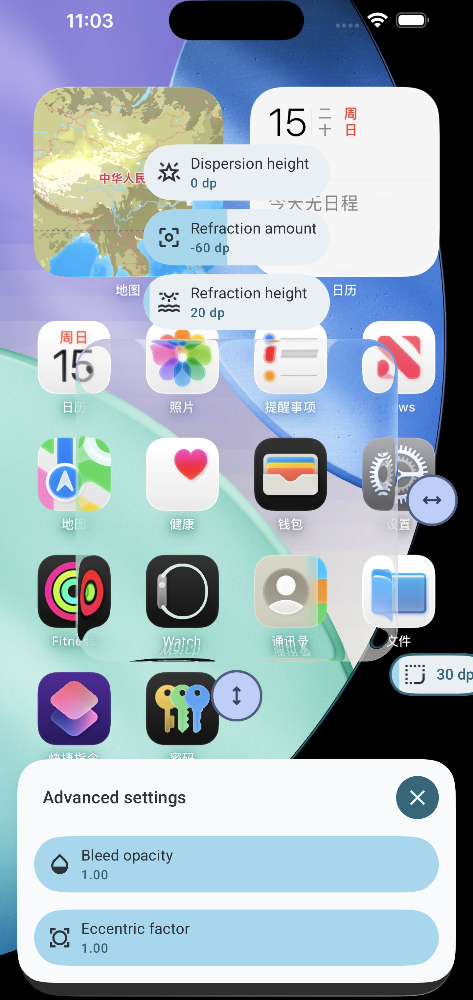

# Bleed comparisons

## Bleed opacity

Inner refraction amount: -60

Inner refraction height: 20

| opacity |                 iOS                 |                 Android                 |
|:-------:|:-----------------------------------:|:---------------------------------------:|
|  0.25   |  |  |
|   0.5   |  |  |
|  0.75   |  |  |
|   1.0   |  |  |
